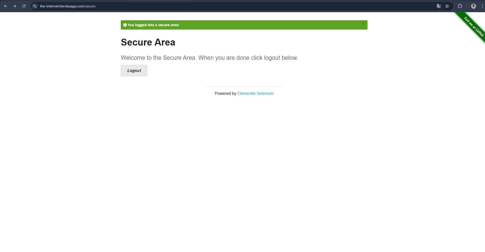

# Bug Report

**ID:** BUG-LOGIN-001
**Título:** Contenido de Secure Area visible tras logout al usar botón Back (cache del navegador)

**Severidad:** S3 
**Prioridad:** P2 

**Entorno:** Windows 11, Chrome (v:145.0.7632.76), The Internet - Form Authentication
**Precondición:** Usuario autenticado en Secure Area

## Pasos para reproducir
1. Ir a la pantalla de login del SUT.
2. Iniciar sesión con credenciales válidas (username: "tomsmith", password: "SuperSecretPassword!").
3. Confirmar que se visualiza la página Secure Area.
4. Hacer click en Logout.
5. En la pantalla de login (post logout), presionar el botón Back del navegador.

## Resultado actual
- Tras realizar logout y presionar el botón Back del navegador, se visualiza nuevamente la página Secure Area.
- El contenido protegido es visible.
- Al refrescar la página (F5), el sistema redirige al login mostrando el mensaje: "You must login to view the secure area!"

## Resultado esperado
- Después del logout, el sistema no debe permitir la visualización de contenido protegido, incluso mediante navegación hacia atrás.
- El usuario debería ser redirigido automáticamente al login o mostrarse una pantalla sin información sensible.
## Evidencia

Video:
[Ver video evidencia - Session persists after logout](https://drive.google.com/drive/folders/1Rp6r6pxBaC6afhGSRmavji8QoxxkmNOT?usp=drive_link)

Captura:
